# 🛒 Grandis-Store

> A production-ready, full-stack e-commerce platform built with a modern microservices-inspired architecture, demonstrating scalable backend engineering, event-driven communication, secure payment processing, and enterprise-grade software design.


---

# 📖 Project Overview

Grandis-Store is a modern **production-ready e-commerce platform** built with **TypeScript**, **Next.js**, **Node.js**, and a **microservices-inspired architecture** designed for scalability, maintainability, and high performance.

Unlike traditional monolithic e-commerce applications, Grandis-Store separates business capabilities into independent backend services that communicate asynchronously through **Apache Kafka**, enabling loose coupling and improved system resilience.

The project demonstrates industry-standard backend engineering practices including:

- Microservices architecture
- Event-driven communication
- Secure authentication
- Distributed data management
- Payment processing with Stripe
- Modular monorepo development
- Shared packages for code reuse
- Type-safe API communication

The repository is organized as a **Turborepo monorepo**, allowing frontend applications, backend services, shared libraries, and database packages to evolve independently while sharing a unified development workflow.

This project was built to showcase real-world software engineering principles commonly used in modern technology companies where scalability, maintainability, and developer productivity are critical.

---

# ✨ Key Features

## Customer Experience

- User authentication with Clerk
- Secure account management
- Browse products by category
- Product search and filtering
- Product detail pages
- Shopping cart management
- Secure checkout process
- Stripe payment integration
- Order history
- Email notifications

---

## Administrative Dashboard

- Product management
- Inventory management
- Category management
- Order management
- Customer management
- Sales monitoring
- Dashboard analytics
- Secure administrator access

---

## Backend Engineering

- Modular service-oriented architecture
- Event-driven communication using Apache Kafka
- Shared TypeScript packages
- RESTful APIs
- Secure authentication middleware
- Database abstraction
- Email service integration
- Payment webhook handling
- Environment-based configuration
- Strong TypeScript typing throughout the project

---

## Developer Experience

- Turborepo monorepo
- PNPM workspaces
- Shared UI components
- Shared TypeScript types
- Reusable packages
- ESLint configuration
- Type-safe development
- Hot reloading
- Modular folder organization

---

# 🏗 Architecture Overview

Grandis-Store follows a **service-oriented architecture** where responsibilities are separated into independent applications and reusable packages.

The platform consists of multiple frontend clients communicating with backend services through REST APIs. Business events are published through Apache Kafka, allowing services to react asynchronously without creating tight dependencies.

Core architectural principles include:

- Separation of concerns
- Domain-driven organization
- Event-driven workflows
- Shared internal packages
- Loose coupling between services
- Independent database modules
- Centralized authentication
- External payment processing
- Scalable deployment model

The repository is divided into three major layers:

### Frontend Layer

- Customer storefront
- Administrative dashboard

---

### Backend Layer

- Authentication
- Product management
- Order management
- Payment processing
- Email notifications

---

### Shared Infrastructure

- Kafka messaging
- Shared UI
- Shared TypeScript types
- Database packages
- Common utilities

---

# 📐 System Design

## High-Level Architecture

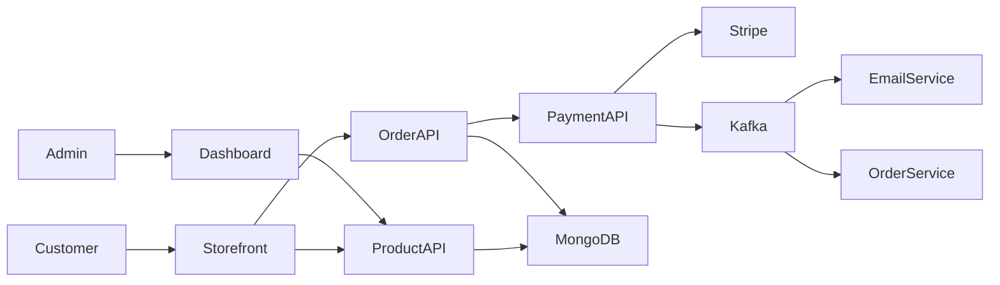

---

## Repository Structure

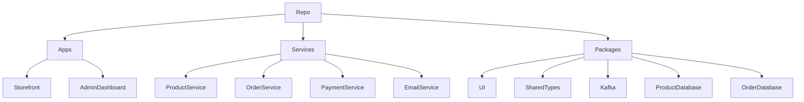

---

## Event-Driven Workflow

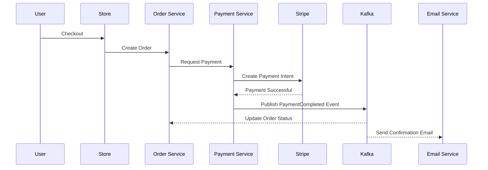

---

# 🛠 Technology Stack

## Frontend

| Technology   | Purpose         |
| ------------ | --------------- |
| Next.js      | React framework |
| React        | User Interface  |
| TypeScript   | Type Safety     |
| Tailwind CSS | Styling         |
| Clerk        | Authentication  |

---

## Backend

| Technology | Purpose                 |
| ---------- | ----------------------- |
| Node.js    | Runtime                 |
| Express.js | REST APIs               |
| Hono       | Lightweight API Service |
| TypeScript | Type Safety             |

---

## Databases

| Technology | Purpose          |
| ---------- | ---------------- |
| MongoDB    | Primary Database |
| Prisma ORM | Database Access  |
| Mongoose   | MongoDB ODM      |

---

## Messaging & Communication

| Technology   | Purpose               |
| ------------ | --------------------- |
| Apache Kafka | Event Streaming       |
| REST API     | Service Communication |

---

## Payment

| Technology      | Purpose              |
| --------------- | -------------------- |
| Stripe          | Payment Processing   |
| Stripe Webhooks | Payment Confirmation |

---

## Email

| Technology | Purpose              |
| ---------- | -------------------- |
| Nodemailer | Transactional Emails |

---

## Monorepo & Tooling

| Technology      | Purpose             |
| --------------- | ------------------- |
| Turborepo       | Monorepo Management |
| PNPM Workspaces | Package Management  |
| ESLint          | Code Quality        |
| Prettier        | Code Formatting     |

---

## Development Practices

- **Type-safe development** using TypeScript
- **Reusable packages** across applications
- **Shared business logic**
- **Strong modularization**
- **Monorepo architecture**
- **Event-driven communication**
- **Secure authentication**
- **Scalable project structure**
- **Production-ready deployment strategy**

# 📁 Monorepo Structure

Grandis-Store is organized as a **Turborepo monorepo**, allowing multiple applications and shared packages to coexist in a single repository while maintaining clear separation of concerns.

This architecture improves code reuse, enforces consistency across services, and simplifies dependency management for both frontend and backend applications.

```
grandis-store/
│
├── apps/
│   ├── admin/                 # Administrative dashboard
│   ├── storefront/            # Customer-facing application
│   ├── product-service/       # Product Management API
│   ├── order-service/         # Order Processing API
│   ├── payment-service/       # Stripe Payment Service
│   └── email-service/         # Email Notification Service
│
├── packages/
│   ├── ui/                    # Shared UI Components
│   ├── kafka/                 # Kafka Producers & Consumers
│   ├── types/                 # Shared TypeScript Types
│   ├── product-db/            # Product Database Layer
│   ├── order-db/              # Order Database Layer
│   └── eslint-config/         # Shared ESLint Configuration
│
├── package.json
├── turbo.json
└── pnpm-workspace.yaml
```

### Why a Monorepo?

The monorepo approach offers several advantages:

- Centralized dependency management
- Shared TypeScript types across services
- Reusable UI components
- Consistent linting and formatting
- Independent application deployment
- Faster local development
- Simplified CI/CD pipelines

Each application remains independently deployable while benefiting from shared internal packages.

---

# 📦 Applications & Packages

Grandis-Store is composed of independent applications responsible for specific business domains, alongside reusable packages that eliminate code duplication.

## Applications

### 🛍 Storefront

The customer-facing application where users can:

- Browse products
- Search and filter inventory
- Manage shopping cart
- Complete purchases
- View previous orders
- Manage their profile

---

### 🛠 Admin Dashboard

A dedicated administration portal for managing the platform.

Responsibilities include:

- Product management
- Inventory updates
- Category administration
- Order monitoring
- Customer management
- Business analytics

---

### 📦 Product Service

Responsible for all product-related operations.

Core responsibilities:

- Product CRUD
- Inventory management
- Product categorization
- Search support
- Product validation

---

### 📄 Order Service

Handles the complete order lifecycle.

Responsibilities include:

- Order creation
- Order validation
- Status updates
- Purchase history
- Inventory synchronization

---

### 💳 Payment Service

A dedicated payment processing service integrated with Stripe.

Responsibilities:

- Payment Intent creation
- Secure payment processing
- Webhook verification
- Payment confirmation
- Event publishing

---

### 📧 Email Service

Handles transactional email communication.

Examples include:

- Order confirmation
- Payment receipts
- Account notifications
- Purchase updates

---

## Shared Packages

To reduce duplication and improve maintainability, Grandis uses internal shared packages.

### 🎨 UI Package

Reusable UI components shared between frontend applications.

Examples:

- Buttons
- Forms
- Cards
- Inputs
- Tables
- Layout components

---

### 🧩 Shared Types

Provides common TypeScript interfaces used across applications.

Examples:

- Product
- Order
- User
- Payment
- API responses
- Kafka events

---

### 📡 Kafka Package

Contains reusable Kafka producers, consumers, topics, and event utilities used throughout backend services.

---

### 🗄 Database Packages

Database access is encapsulated into dedicated packages.

Benefits include:

- Separation of persistence logic
- Reusable models
- Easier testing
- Centralized database configuration

---

# 🔐 Authentication Flow

Grandis-Store uses **Clerk Authentication** to provide secure and scalable identity management.

Authentication responsibilities are delegated to Clerk, allowing backend services to remain stateless while trusting verified JWTs.

## Authentication Workflow

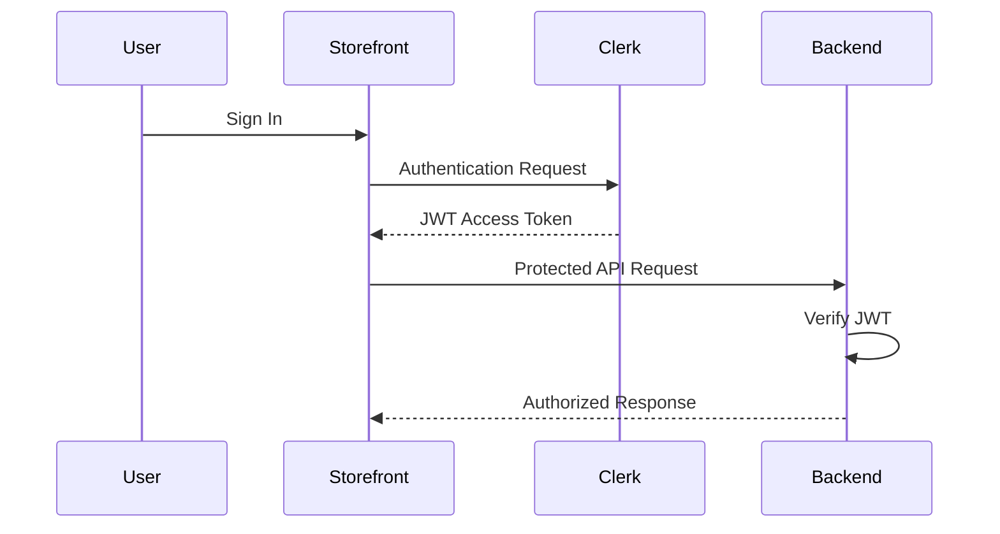

### Security Features

- JWT-based authentication
- Secure session management
- Protected API routes
- Middleware authorization
- Token verification
- Role-based access control (where applicable)
- HTTPS-ready deployment

Because authentication is centralized, every backend service can independently validate incoming tokens without sharing session state.

---

# 🛍 Product Management

Product management is isolated into its own backend service, allowing inventory operations to evolve independently from order processing or payments.

## Product Lifecycle

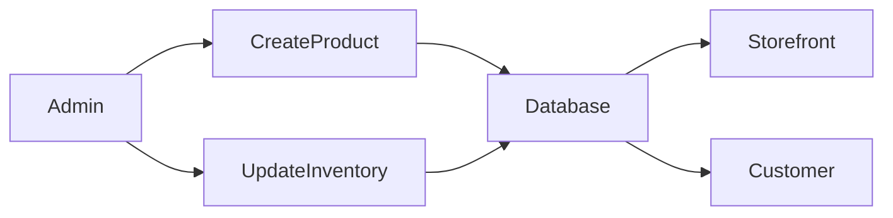

The Product Service provides functionality for:

- Product creation
- Product updates
- Product deletion
- Category management
- Product search
- Inventory tracking
- Product validation

Separating product management into its own domain improves scalability and simplifies future enhancements such as:

- Full-text search
- Product recommendations
- Inventory forecasting
- Multi-vendor support

---

# 🛒 Shopping Cart & Checkout

Grandis provides a streamlined shopping experience designed around simplicity and reliability.

Customers can browse products, manage their cart, and securely complete purchases through Stripe.

## Checkout Workflow

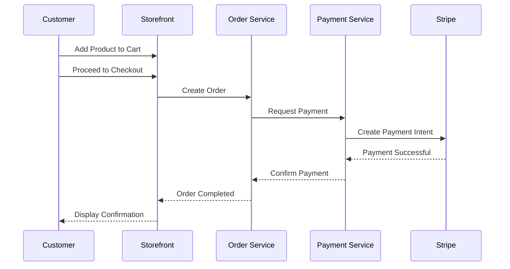

### Shopping Experience

Customers can:

- Browse available products
- Search and filter inventory
- Add products to their cart
- Modify cart quantities
- Remove unwanted items
- Review order summary
- Complete secure payment
- Receive purchase confirmation

### Checkout Features

- Secure Stripe payment integration
- Order validation
- Payment verification
- Real-time order updates
- Transactional email notifications
- Persistent order history

The checkout process is designed to keep payment processing isolated from business logic, improving maintainability and reducing coupling between services.

# 💳 Payment Workflow

Grandis integrates **Stripe** to provide secure, PCI-compliant payment processing without exposing sensitive payment information to backend services.

Rather than processing card details directly, the Payment Service delegates payment authorization to Stripe using **Payment Intents**, ensuring a secure and industry-standard checkout experience.

## Payment Architecture

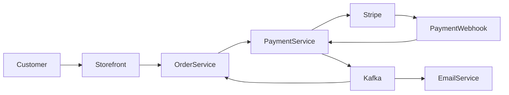

---

## Payment Flow

1. Customer proceeds to checkout.
2. The Storefront requests a new order.
3. The Order Service validates the order.
4. The Payment Service creates a Stripe Payment Intent.
5. The client securely completes payment using Stripe.
6. Stripe sends a signed webhook to the Payment Service.
7. The Payment Service verifies the webhook signature.
8. A `PaymentCompleted` event is published to Kafka.
9. The Order Service updates the order status.
10. The Email Service sends an order confirmation email.

---

## Why Webhooks?

Using webhooks instead of trusting the frontend ensures:

- Payment authenticity
- Fraud prevention
- Reliable payment confirmation
- Idempotent payment processing
- Protection against client-side manipulation

Only verified webhook events are considered successful payments.

---

## Payment Features

- Stripe Payment Intents
- Secure checkout
- Webhook verification
- Payment confirmation
- Event publication
- Order synchronization
- Transactional email notifications

---

# 📡 Event-Driven Communication

Grandis adopts an **event-driven architecture** using **Apache Kafka** to decouple backend services and improve scalability.

Instead of tightly coupling services through direct API calls, business events are published to Kafka topics where interested services consume and react independently.

This architecture improves resilience, maintainability, and horizontal scalability.

---

## Event Flow

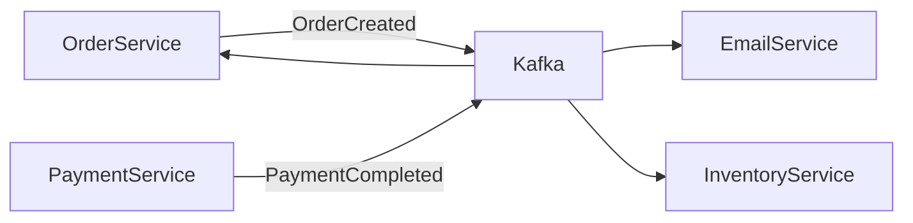

---

## Why Kafka?

Using Apache Kafka provides several advantages:

- Loose coupling between services
- Reliable asynchronous communication
- Horizontal scalability
- Improved fault tolerance
- Event replay capability
- High throughput messaging
- Independent service evolution

Backend services no longer need to know about one another directly—they simply publish or consume events.

---

## Event Lifecycle

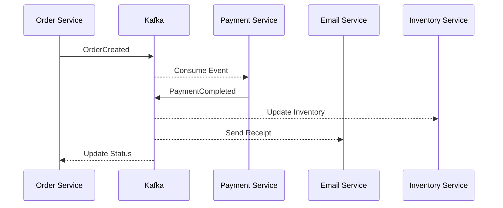

---

## Example Business Events

| Event              | Purpose                     |
| ------------------ | --------------------------- |
| `OrderCreated`     | Customer places an order    |
| `PaymentCompleted` | Stripe payment succeeds     |
| `PaymentFailed`    | Payment unsuccessful        |
| `InventoryUpdated` | Product stock changes       |
| `OrderCancelled`   | Order cancellation          |
| `EmailRequested`   | Trigger transactional email |

---

# 🗄 Database Design

Grandis follows a **modular persistence architecture**, separating database access into reusable packages while allowing services to manage their own business logic.

This separation improves maintainability and encourages clean architecture principles.

---

## Database Architecture

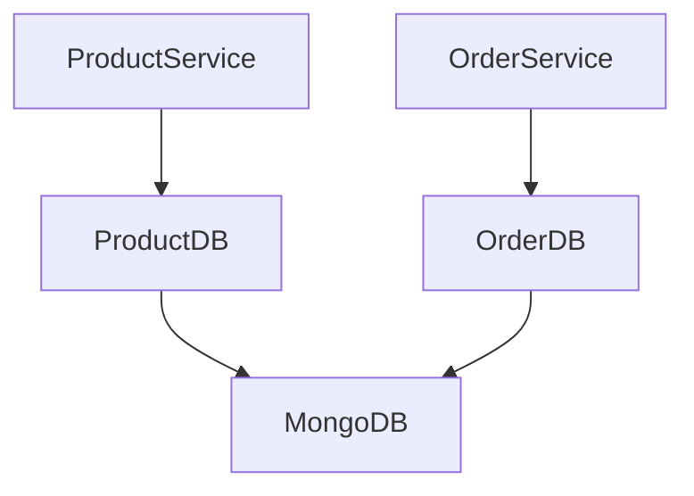

---

## Persistence Strategy

Database logic is isolated from application logic.

Each database package is responsible for:

- Database connection
- Model definitions
- Repository operations
- Query abstraction
- Validation

This allows backend services to focus solely on business rules.

---

## Technologies

| Technology               | Responsibility                 |
| ------------------------ | ------------------------------ |
| MongoDB                  | Primary document database      |
| Prisma ORM               | Type-safe database access      |
| Mongoose                 | MongoDB schema modeling        |
| Shared Database Packages | Encapsulated persistence layer |

---

## Design Principles

- Separation of persistence and business logic
- Reusable database modules
- Type-safe queries
- Schema validation
- Centralized connection management
- Independent evolution of data models

---

# 🔌 API Overview

Grandis exposes RESTful APIs organized around individual business domains.

Each service owns its resources and encapsulates its own business logic.

---

## Service Responsibilities

| Service         | Responsibility                              |
| --------------- | ------------------------------------------- |
| Product Service | Product catalog and inventory               |
| Order Service   | Order lifecycle management                  |
| Payment Service | Stripe integration and payment verification |
| Email Service   | Transactional email delivery                |

---

## API Design Principles

The APIs follow modern REST conventions:

- Resource-oriented endpoints
- JSON request/response payloads
- Stateless communication
- JWT authentication
- Structured error handling
- HTTP status code compliance

---

## Typical Request Flow

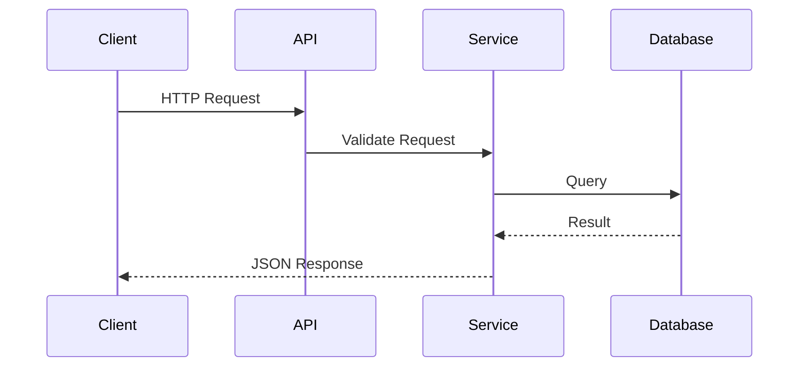

---

## Common Response Structure

```json
{
  "success": true,
  "message": "Operation completed successfully.",
  "data": {}
}
```

Errors follow a consistent structure to simplify frontend error handling and debugging.

---

# ⚙ Environment Variables

Grandis uses environment-specific configuration to separate secrets from source code and support multiple deployment environments.

Sensitive credentials are never committed to version control.

---

## Storefront/Client

```env
NEXT_PUBLIC_CLERK_PUBLISHABLE_KEY=
CLERK_SECRET_KEY=
NEXT_PUBLIC_PAYMENT_SERVICE_URL=
NEXT_PUBLIC_ORDER_SERVICE_URL=
NEXT_PUBLIC_PRODUCT_SERVICE_URL=

```

---

## Admin Dashboard

```env
NEXT_PUBLIC_CLERK_PUBLISHABLE_KEY=
CLERK_SECRET_KEY=
NEXT_PUBLIC_PAYMENT_SERVICE_URL=
NEXT_PUBLIC_ORDER_SERVICE_URL=
NEXT_PUBLIC_PRODUCT_SERVICE_URL=
NEXT_PUBLIC_AUTH_SERVICE_URL=
NEXT_PUBLIC_CLOUDINARY_CLOUD_NAME=
```

---

## Product Service

```env
PORT=
CLERK_PUBLISHABLE_KEY=
CLERK_SECRET_KEY=
```

---

## Order Service

```env
PORT=
CLERK_PUBLISHABLE_KEY=
CLERK_SECRET_KEY=
MONGO_URL=
```

---

## Payment Service

```env
PORT=
STRIPE_SECRET_KEY=
STRIPE_WEBHOOK_SECRET=
CLERK_PUBLISHABLE_KEY=
CLERK_SECRET_KEY=

```

---

## Email Service

```env
GOOGLE_CLIENT_ID=
GOOGLE_CLIENT_SECRET=
GOOGLE_REFRESH_TOKEN=
EMAIL_FROM=
```

---

## Security Best Practices

- Secrets stored in environment variables
- `.env` files excluded from version control
- Separate development and production configurations
- Principle of least privilege for API keys
- Server-side secret management in production
- Secure webhook signature verification

# 🚀 Getting Started

Follow the steps below to set up Grandis for local development.

## Prerequisites

Ensure the following tools are installed before running the project:

| Tool                    | Recommended Version |
| ----------------------- | ------------------- |
| Node.js                 | 20+                 |
| PNPM                    | 10+                 |
| Git                     | Latest              |
| MongoDB                 | 7+                  |
| Apache Kafka            | Latest Stable       |
| Stripe CLI _(optional)_ | Latest              |

---

## Clone the Repository

```bash
git clone https://github.com/Ayyah-Coded/grandis-commerce.git

cd grandis-store
```

---

## Install Dependencies

```bash
pnpm install
```

---

## Configure Environment Variables

Create the required `.env` files for each application and service.

Refer to the **Environment Variables** section above for the required configuration.

---

## Start Development

Run all applications concurrently using Turborepo:

```bash
pnpm dev
```

Or start an individual application:

```bash
pnpm --filter storefront dev

pnpm --filter admin dev

pnpm --filter product-service dev
```

---

## Build for Production

```bash
pnpm build
```

---

## Run Linting

```bash
pnpm lint
```

---

## Type Checking

```bash
pnpm check-types
```

---

# ☁ Deployment

Grandis-Store has been designed with independent deployment in mind.

Each frontend application and backend service can be deployed independently, enabling horizontal scalability and simplified infrastructure management.

## Suggested Deployment Stack

| Component        | Recommended Platform                |
| ---------------- | ----------------------------------- |
| Storefront       | Vercel                              |
| Admin Dashboard  | Vercel                              |
| Backend Services | Railway / Render / Fly.io / AWS ECS |
| MongoDB          | MongoDB Atlas                       |
| Kafka            | Confluent Cloud / Redpanda          |
| Stripe           | Stripe Dashboard                    |
| Email            | Gmail SMTP / SendGrid / Mailgun     |

---

## Deployment Strategy

```
Frontend
    ↓
API Services
    ↓
Kafka
    ↓
Background Services
    ↓
MongoDB
```

Each service can be independently:

- Updated
- Scaled
- Monitored
- Restarted

without affecting the rest of the platform.

---

# ⚡ Performance Optimizations

Grandis incorporates several architectural decisions aimed at improving scalability, responsiveness, and long-term maintainability.

## Frontend Optimizations

- Server-side rendering with Next.js
- Optimized image loading
- Lazy loading
- Component reuse
- Efficient routing
- Type-safe API communication

---

## Backend Optimizations

- Modular service architecture
- Independent service deployment
- Lightweight REST APIs
- Asynchronous event processing
- Shared internal packages
- Reduced service coupling

---

## Database Optimizations

- Centralized connection management
- Schema validation
- Query abstraction
- Modular persistence layer

---

## Development Optimizations

- Turborepo incremental builds
- PNPM workspace caching
- Shared TypeScript configuration
- Shared ESLint configuration
- Reusable UI components

---

# 🔒 Security

Security was considered throughout the architecture to ensure safe handling of user data and payment processing.

## Authentication

- Clerk Authentication
- JWT verification
- Protected routes
- Secure session handling

---

## Payments

- Stripe Payment Intents
- Webhook signature verification
- PCI-compliant payment processing
- No storage of card information

---

## API Security

- Input validation
- Authentication middleware
- Structured error handling
- Environment-based configuration

---

## Secrets Management

- Environment variables
- No credentials committed to source control
- Separate development and production configurations

---

# 🛣 Future Improvements

Although Grandis demonstrates a production-ready architecture, several enhancements could further extend the platform.

### Commerce

- Product reviews
- Wishlist functionality
- Coupons & promotions
- Product recommendations
- Multi-vendor marketplace
- Inventory reservations

---

### Customer Experience

- Live chat support
- Push notifications
- Recently viewed products
- Personalized recommendations
- Multi-language support

---

### Engineering

- Redis caching
- Docker Compose
- Kubernetes deployment
- CI/CD pipelines
- Distributed tracing
- Centralized logging
- Monitoring with Prometheus & Grafana
- Rate limiting
- API Gateway
- Service discovery

---

### Business

- Analytics dashboard
- Sales reports
- Customer segmentation
- Marketing campaigns
- Refund management

---

# 🎯 Skills Demonstrated

This project showcases practical experience with modern full-stack software engineering principles commonly used in production environments.

## Backend Engineering

- TypeScript
- Node.js
- Express.js
- REST API Design
- Authentication
- Payment Integration
- Event-Driven Architecture
- Apache Kafka
- MongoDB
- Prisma ORM
- Mongoose

---

## Frontend Engineering

- Next.js
- React
- Tailwind CSS
- Clerk Authentication
- Component Architecture

---

## Software Architecture

- Monorepo Development
- Modular Design
- Shared Packages
- Separation of Concerns
- Distributed Systems Concepts
- Service-Oriented Architecture
- Domain-Oriented Organization

---

## DevOps & Tooling

- Turborepo
- PNPM Workspaces
- Git
- Environment Management
- Production Deployment
- Scalable Project Structure

---

# 📸 Screenshots

> Screenshots will be added soon.

Suggested screenshots include:

- Home Page
- Product Listing
- Product Details
- Shopping Cart
- Checkout
- Stripe Payment
- Order History
- Admin Dashboard
- Product Management
- Mobile Responsive Layout

---

# 🤝 Contributing

Contributions are welcome!

If you'd like to improve Grandis, feel free to:

1. Fork the repository.
2. Create a new feature branch.
3. Commit your changes.
4. Push the branch.
5. Open a Pull Request.

Please ensure all code follows the project's coding standards and passes linting before submitting.

---

# 📄 License

This project is licensed under the **MIT License**.

You are free to use, modify, and distribute this software in accordance with the terms of the license.

---

# 👨‍💻 Author

**Yahaya Hayatullahi**

Backend & Full-Stack Software Engineer passionate about building scalable, distributed systems with modern web technologies.

### Connect with me

- GitHub: https://github.com/Ayyah-Coded

<!-- - LinkedIn: https://linkedin.com/in/<your-profile> -->
<!-- - Portfolio: https://<your-portfolio> -->

---

## ⭐ Support

If you found this project helpful or interesting:

- ⭐ Star the repository
- 🍴 Fork the project
- 🐛 Report issues
- 💡 Suggest new features
- 🤝 Share it with others

Your support helps improve the project and encourages future open-source development.

---

> **Grandis-Store** was built as a showcase of modern software engineering practices, emphasizing scalability, maintainability, and clean architecture. It serves as both a production-ready e-commerce platform and a learning resource for developers exploring distributed systems, event-driven design, and full-stack application development.
