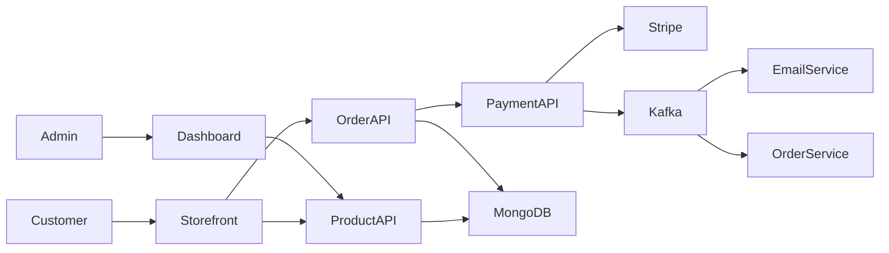
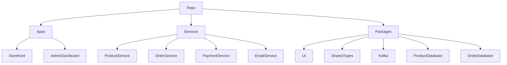
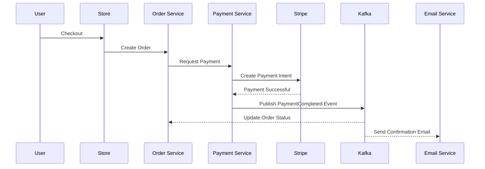

# 🛒 Grandis-Store

> A production-ready, full-stack e-commerce platform built with a modern microservices-inspired architecture, demonstrating scalable backend engineering, event-driven communication, secure payment processing, and enterprise-grade software design.

---

# 📖 Project Overview

Grandis-Store is a modern **production-ready e-commerce platform** built with **TypeScript**, **Next.js**, **Node.js**, and a **microservices-inspired architecture** designed for scalability, maintainability, and high performance.

Unlike traditional monolithic e-commerce applications, Grandis-Store separates business capabilities into independent backend services that communicate asynchronously through **Apache Kafka**, enabling loose coupling and improved system resilience.

The project demonstrates industry-standard backend engineering practices including:

- Microservices architecture
- Event-driven communication
- Secure authentication
- Distributed data management
- Payment processing with Stripe
- Modular monorepo development
- Shared packages for code reuse
- Type-safe API communication

The repository is organized as a **Turborepo monorepo**, allowing frontend applications, backend services, shared libraries, and database packages to evolve independently while sharing a unified development workflow.

This project was built to showcase real-world software engineering principles commonly used in modern technology companies where scalability, maintainability, and developer productivity are critical.

---

# ✨ Key Features

## Customer Experience

- User authentication with Clerk
- Secure account management
- Browse products by category
- Product search and filtering
- Product detail pages
- Shopping cart management
- Secure checkout process
- Stripe payment integration
- Order history
- Email notifications

---

## Administrative Dashboard

- Product management
- Inventory management
- Category management
- Order management
- Customer management
- Sales monitoring
- Dashboard analytics
- Secure administrator access

---

## Backend Engineering

- Modular service-oriented architecture
- Event-driven communication using Apache Kafka
- Shared TypeScript packages
- RESTful APIs
- Secure authentication middleware
- Database abstraction
- Email service integration
- Payment webhook handling
- Environment-based configuration
- Strong TypeScript typing throughout the project

---

## Developer Experience

- Turborepo monorepo
- PNPM workspaces
- Shared UI components
- Shared TypeScript types
- Reusable packages
- ESLint configuration
- Type-safe development
- Hot reloading
- Modular folder organization

---

# 🏗 Architecture Overview

Grandis-Store follows a **service-oriented architecture** where responsibilities are separated into independent applications and reusable packages.

The platform consists of multiple frontend clients communicating with backend services through REST APIs. Business events are published through Apache Kafka, allowing services to react asynchronously without creating tight dependencies.

Core architectural principles include:

- Separation of concerns
- Domain-driven organization
- Event-driven workflows
- Shared internal packages
- Loose coupling between services
- Independent database modules
- Centralized authentication
- External payment processing
- Scalable deployment model

The repository is divided into three major layers:

### Frontend Layer

- Customer storefront
- Administrative dashboard

---

### Backend Layer

- Authentication
- Product management
- Order management
- Payment processing
- Email notifications

---

### Shared Infrastructure

- Kafka messaging
- Shared UI
- Shared TypeScript types
- Database packages
- Common utilities

---

# 📐 System Design

## High-Level Architecture

---

## Repository Structure

---

## Event-Driven Workflow

---

# 🛠 Technology Stack

## Frontend

| Technology | Purpose |
|------------|----------|
| Next.js | React framework |
| React | User Interface |
| TypeScript | Type Safety |
| Tailwind CSS | Styling |
| Clerk | Authentication |

---

## Backend

| Technology | Purpose |
|------------|----------|
| Node.js | Runtime |
| Express.js | REST APIs |
| Hono | Lightweight API Service |
| TypeScript | Type Safety |

---

## Databases

| Technology | Purpose |
|------------|----------|
| MongoDB | Primary Database |
| Prisma ORM | Database Access |
| Mongoose | MongoDB ODM |

---

## Messaging & Communication

| Technology | Purpose |
|------------|----------|
| Apache Kafka | Event Streaming |
| REST API | Service Communication |

---

## Payment

| Technology | Purpose |
|------------|----------|
| Stripe | Payment Processing |
| Stripe Webhooks | Payment Confirmation |

---

## Email

| Technology | Purpose |
|------------|----------|
| Nodemailer | Transactional Emails |

---

## Monorepo & Tooling

| Technology | Purpose |
|------------|----------|
| Turborepo | Monorepo Management |
| PNPM Workspaces | Package Management |
| ESLint | Code Quality |
| Prettier | Code Formatting |

---

## Development Practices

- **Type-safe development** using TypeScript
- **Reusable packages** across applications
- **Shared business logic**
- **Strong modularization**
- **Monorepo architecture**
- **Event-driven communication**
- **Secure authentication**
- **Scalable project structure**
- **Production-ready deployment strategy**
