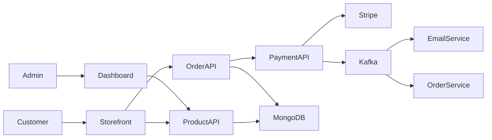
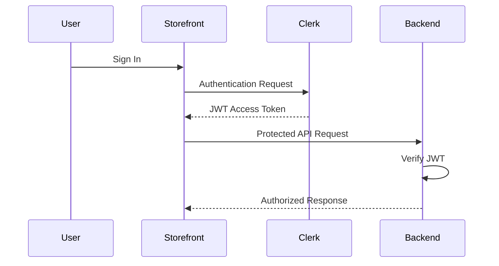
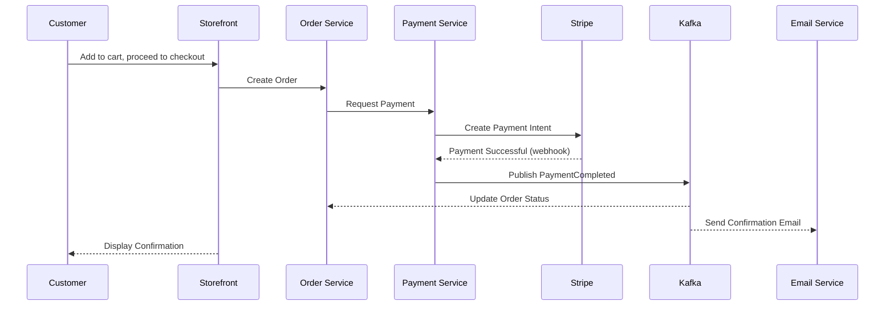
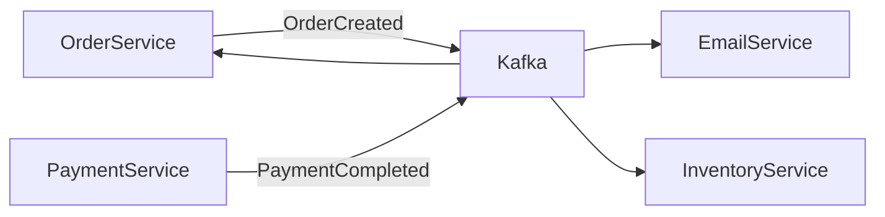
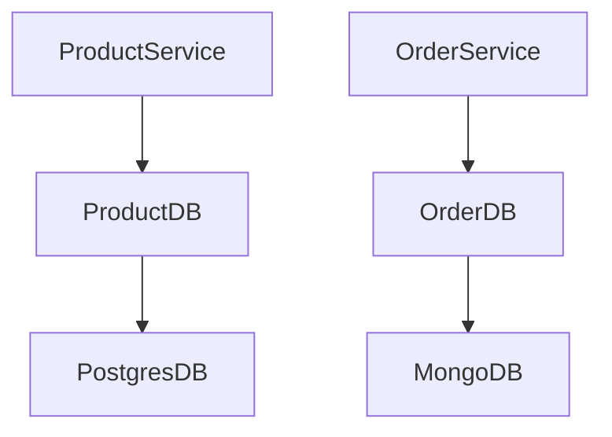
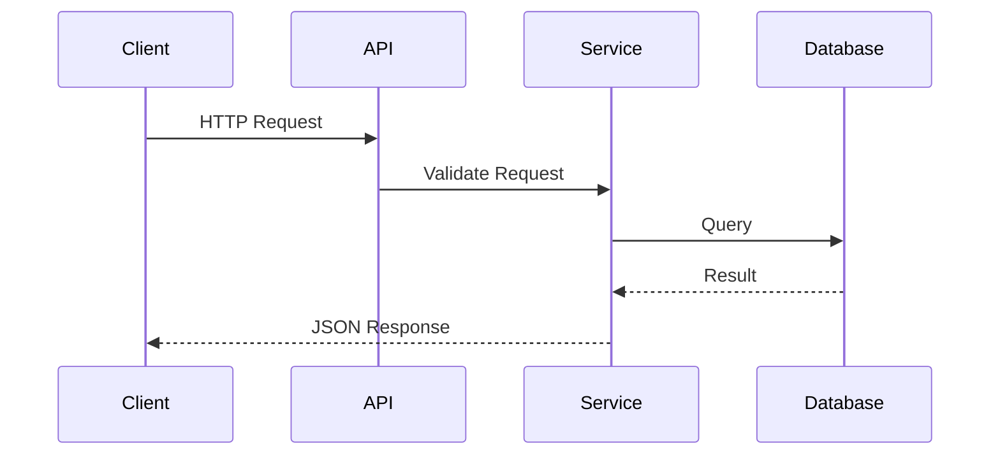
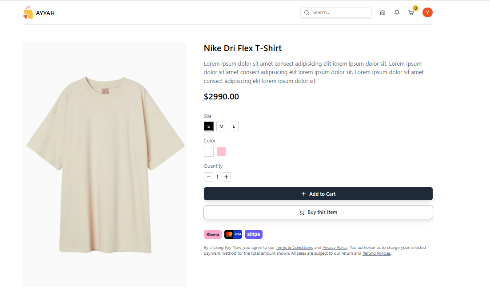
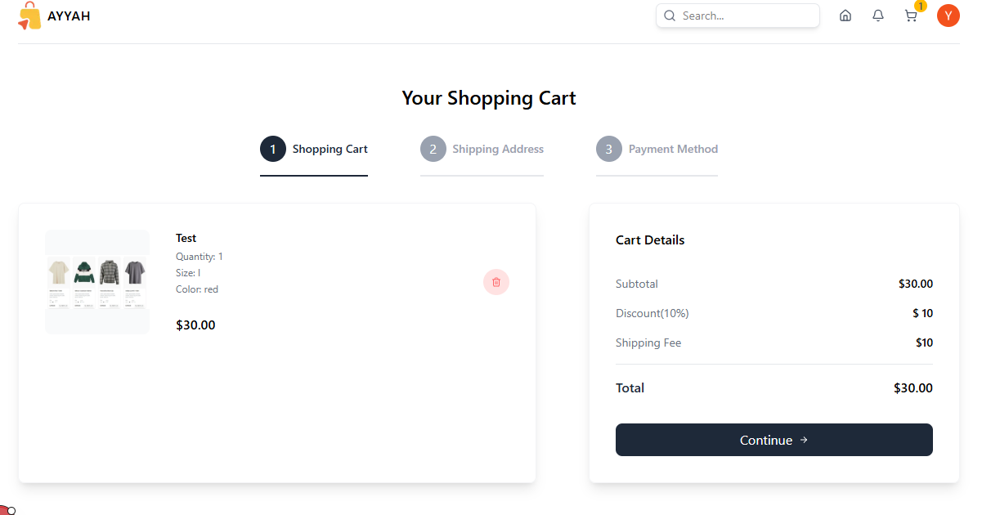
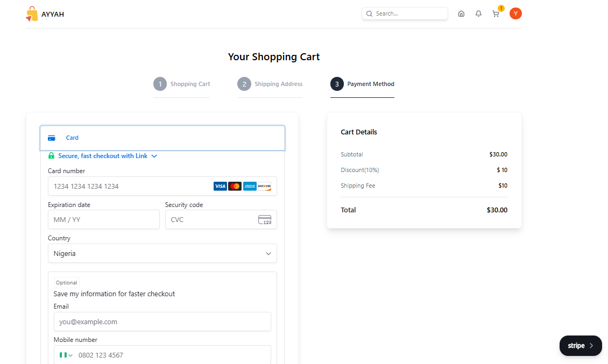
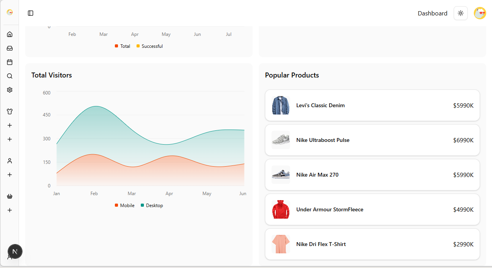

# 🛒 Grandis-Store

> A production-ready, full-stack e-commerce platform built with a microservices-inspired architecture — demonstrating scalable backend engineering, event-driven communication, secure payment processing, and enterprise-grade software design.


---

## Table of Contents

1. [Overview](#overview)
2. [Key Features](#key-features)
3. [Architecture](#architecture)
4. [Technology Stack](#technology-stack)
5. [Monorepo Structure](#monorepo-structure)
6. [Applications & Packages](#applications--packages)
7. [Authentication](#authentication)
8. [Order & Payment Flow](#order--payment-flow)
9. [Event-Driven Communication (Kafka)](#event-driven-communication-kafka)
10. [Database Design](#database-design)
11. [API Overview](#api-overview)
12. [Environment Variables](#environment-variables)
13. [Getting Started](#getting-started)
14. [Deployment](#deployment)
15. [Security](#security)
16. [Future Improvements](#future-improvements)
17. [Screenshots](#screenshots)
18. [Contributing](#contributing)
19. [License & Author](#license--author)

---

## Overview

Grandis-Store separates business capabilities into independent backend services that communicate asynchronously through **Apache Kafka**, rather than the tightly coupled structure of a traditional monolithic e-commerce app. The repository is organized as a **Turborepo monorepo**, so frontend apps, backend services, and shared libraries evolve independently while sharing one development workflow.

The project demonstrates:

- Microservices-inspired backend architecture
- Event-driven communication between services
- Secure authentication (Clerk) and payment processing (Stripe)
- Modular monorepo development with shared, type-safe packages

---

## Key Features

**Customer Experience**
Authentication & account management (Clerk) · product browsing, search & filtering · shopping cart · secure Stripe checkout · order history · email notifications

**Admin Dashboard**
Product, inventory & category management · order management · customer management · sales & dashboard analytics · secured admin-only access

**Backend Engineering**
Service-oriented architecture · event-driven communication via Kafka · shared TypeScript packages · RESTful APIs · auth middleware · payment webhook handling · environment-based configuration

**Developer Experience**
Turborepo + pnpm workspaces · shared UI components and TypeScript types · shared ESLint config · hot reloading · modular folder structure

---

## Architecture

Multiple frontend clients talk to backend services over REST. Business events (order placed, payment completed, etc.) are published to Kafka so services can react asynchronously without depending on one another directly.



**Core principles:** separation of concerns, domain-driven organization, event-driven workflows, loose coupling between services, independent database modules per domain, and centralized (but stateless) authentication.

| Layer                     | Contains                                                                            |
| ------------------------- | ----------------------------------------------------------------------------------- |
| **Frontend**              | Customer storefront, admin dashboard                                                |
| **Backend**               | Auth, product management, order management, payment processing, email notifications |
| **Shared infrastructure** | Kafka messaging, shared UI, shared types, database packages, common utilities       |

---

## Technology Stack

| Category           | Technology                                                   |
| ------------------ | ------------------------------------------------------------ |
| Frontend           | Next.js, React, TypeScript, Tailwind CSS, Clerk              |
| Backend            | Node.js, Express.js, Hono, Fastify, TypeScript               |
| Databases          | MongoDB, Prisma ORM, Mongoose                                |
| Messaging          | Apache Kafka (event streaming), REST (service communication) |
| Payments           | Stripe, Stripe Webhooks                                      |
| Email              | Nodemailer                                                   |
| Monorepo & Tooling | Turborepo, pnpm Workspaces, ESLint, Prettier                 |

---

## Monorepo Structure

```
grandis-store/
│
├── apps/
│   ├── admin/                 # Administrative dashboard
│   ├── storefront/            # Customer-facing application
│   ├── product-service/       # Product Management API
│   ├── order-service/         # Order Processing API
│   ├── payment-service/       # Stripe Payment Service
│   └── email-service/         # Email Notification Service
│
├── packages/
│   ├── kafka/                 # Kafka Producers & Consumers
│   ├── types/                 # Shared TypeScript Types
│   ├── product-db/            # Product Database Layer
│   ├── order-db/              # Order Database Layer
│   └── eslint-config/         # Shared ESLint Configuration
│
├── package.json
├── turbo.json
├── docker-compose.yml
└── pnpm-workspace.yaml
```

**Why a monorepo?** Centralized dependency management, shared types across apps, consistent linting, and simplified CI/CD — while every application stays independently deployable.

---

## Applications & Packages

### Storefront

Customer-facing app: browse, search/filter, cart management, checkout, order history, profile management.

### Admin Dashboard

Product, inventory, and category administration; order monitoring; customer management; business analytics.

### Product Service

Product CRUD, inventory management, categorization, search support, and validation. Isolated from order/payment logic so the product domain can evolve independently — e.g. full-text search, recommendations, or multi-vendor support later.

### Order Service

Order creation, validation, status updates, purchase history, and inventory synchronization.

### Payment Service

Stripe Payment Intent creation, webhook verification, payment confirmation, and event publication.

### Email Service

Transactional email: order confirmations, payment receipts, account notifications.

### Shared Packages

| Package                   | Purpose                                                                        |
| ------------------------- | ------------------------------------------------------------------------------ |
| `types`                   | Shared interfaces — Product, Order, User, Payment, API responses, Kafka events |
| `kafka`                   | Reusable producers, consumers, topics, and event utilities                     |
| `product-db` / `order-db` | Encapsulated persistence layer — connection, models, repositories, validation  |

---

## Authentication

Grandis-Store delegates identity management to **Clerk**, keeping backend services stateless: each service independently verifies incoming JWTs without sharing session state.



Security features: JWT-based auth, secure session management, protected/middleware-guarded routes, role-based access where applicable, HTTPS-ready deployment.

---

## Order & Payment Flow

Checkout, order creation, and payment are deliberately kept in separate services so payment processing never blocks or tangles with core business logic. Stripe **Payment Intents** handle card data directly, so sensitive payment information never touches Grandis's own servers.



**Why webhooks, not client confirmation?** Trusting a signed Stripe webhook — rather than a "payment succeeded" message from the browser — prevents client-side manipulation and gives idempotent, fraud-resistant payment confirmation. Only a verified webhook event marks a payment as successful.

**Customer-facing checkout features:** cart management, order summary review, real-time order status, persistent order history, transactional email confirmation.

---

## Event-Driven Communication (Kafka)

Instead of services calling each other directly, they publish domain events to Kafka topics that interested services consume independently.



| Event              | Purpose                       |
| ------------------ | ----------------------------- |
| `OrderCreated`     | Customer places an order      |
| `PaymentCompleted` | Stripe payment succeeds       |
| `PaymentFailed`    | Payment unsuccessful          |
| `InventoryUpdated` | Product stock changes         |
| `OrderCancelled`   | Order cancellation            |
| `EmailRequested`   | Trigger a transactional email |

**Why Kafka over direct API calls?** Loose coupling, reliable async delivery, horizontal scalability of consumers, event replay, and fault tolerance — services no longer need to know about each other, just the events they care about. The trade-off is added operational overhead (a broker to run) and eventual, rather than immediate, consistency.

---

## Database Design

Each domain owns its persistence logic through a dedicated database package, keeping business logic and data access cleanly separated.



Each database package handles connection management, model definitions, repository operations, query abstraction, and validation — so backend services focus purely on business rules.

| Technology         | Responsibility                            |
| ------------------ | ----------------------------------------- |
| MongoDB            | Primary document database                 |
| Prisma ORM         | Type-safe database access                 |
| Mongoose           | MongoDB schema modeling                   |
| Shared DB packages | Encapsulated persistence layer per domain |

---

## API Overview

Grandis exposes RESTful APIs organized by business domain — each service owns its resources and logic.

| Service         | Responsibility                            |
| --------------- | ----------------------------------------- |
| Product Service | Product catalog & inventory               |
| Order Service   | Order lifecycle management                |
| Payment Service | Stripe integration & payment verification |
| Email Service   | Transactional email delivery              |

**Conventions:** resource-oriented endpoints, JSON payloads, stateless communication, JWT auth, structured error handling, standard HTTP status codes.



**Standard response shape:**

```json
{ "success": true, "message": "Operation completed successfully.", "data": {} }
```

Errors follow the same structure (`success: false`, `message`, `data`) for consistent frontend handling.

---

## Environment Variables

Each app/service keeps its own `.env`; secrets are never committed to source control.

**Storefront**

```env
NEXT_PUBLIC_CLERK_PUBLISHABLE_KEY=
CLERK_SECRET_KEY=
NEXT_PUBLIC_PAYMENT_SERVICE_URL=
NEXT_PUBLIC_ORDER_SERVICE_URL=
NEXT_PUBLIC_PRODUCT_SERVICE_URL=
```

**Admin Dashboard**

```env
NEXT_PUBLIC_CLERK_PUBLISHABLE_KEY=
CLERK_SECRET_KEY=
NEXT_PUBLIC_PAYMENT_SERVICE_URL=
NEXT_PUBLIC_ORDER_SERVICE_URL=
NEXT_PUBLIC_PRODUCT_SERVICE_URL=
NEXT_PUBLIC_AUTH_SERVICE_URL=
NEXT_PUBLIC_CLOUDINARY_CLOUD_NAME=
```

**Product Service**

```env
PORT=
CLERK_PUBLISHABLE_KEY=
CLERK_SECRET_KEY=
```

**Order Service**

```env
PORT=
CLERK_PUBLISHABLE_KEY=
CLERK_SECRET_KEY=
MONGO_URL=
```

**Payment Service**

```env
PORT=
STRIPE_SECRET_KEY=
STRIPE_WEBHOOK_SECRET=
CLERK_PUBLISHABLE_KEY=
CLERK_SECRET_KEY=
```

**Email Service**

```env
GOOGLE_CLIENT_ID=
GOOGLE_CLIENT_SECRET=
GOOGLE_REFRESH_TOKEN=
EMAIL_FROM=
```

---

## Getting Started

### Prerequisites

| Tool                    | Recommended Version |
| ----------------------- | ------------------- |
| Node.js                 | 20+                 |
| pnpm                    | 10+                 |
| Git                     | Latest              |
| MongoDB                 | 7+                  |
| Apache Kafka            | Latest stable       |
| Stripe CLI _(optional)_ | Latest              |

### Setup

```bash
# Clone and install
git clone https://github.com/Ayyah-Coded/grandis-commerce.git
cd grandis-store
pnpm install

# Configure .env files for each app/service (see Environment Variables above)

# Run everything via Turborepo
turbo dev

# ...or run a single app/service
turbo --filter storefront dev
turbo --filter admin dev
turbo --filter product-service dev
```

### Common commands

```bash
turbo build         # build everything
turbo lint          # lint the monorepo
turbo check-types   # type-check across packages
```

---

## Deployment

Each frontend app and backend service deploys independently — updated, scaled, restarted, and monitored without affecting the rest of the platform.

```
Frontend → API Services → Kafka → Background Services → MongoDB
```

| Component          | Recommended Platform                |
| ------------------ | ----------------------------------- |
| Storefront / Admin | Vercel                              |
| Backend services   | Railway / Render / Fly.io / AWS ECS |
| MongoDB            | MongoDB Atlas                       |
| Kafka              | Confluent Cloud / Redpanda          |
| Email              | Gmail SMTP / SendGrid / Mailgun     |

**Performance notes:** Next.js SSR, image and route lazy-loading on the frontend; independent service scaling and shared internal packages on the backend; Turborepo incremental builds and pnpm workspace caching in development.

---

## Security

**Authentication:** Clerk-issued JWTs, verified independently by each service; protected routes; secure session handling.

**Payments:** Stripe Payment Intents (no card data touches Grandis servers), signed webhook verification, PCI-compliant flow.

**API:** input validation, auth middleware on protected routes, structured error handling.

**Secrets:** environment variables only, `.env` excluded from version control, separate dev/production configs, least-privilege API keys.

---

## Future Improvements

**Commerce:** product reviews, wishlists, coupons & promotions, recommendations, multi-vendor marketplace, inventory reservations

**Customer experience:** live chat, push notifications, recently viewed items, personalization, multi-language support

**Engineering:** Redis caching, Docker Compose / Kubernetes, CI/CD pipelines, distributed tracing, centralized logging, Prometheus/Grafana monitoring, rate limiting, an API gateway, service discovery

**Business:** analytics dashboard, sales reports, customer segmentation, marketing campaigns, refund management

---

## Screenshots







<!-- > Coming soon — planned: home page, product listing & detail pages, cart, checkout, Stripe payment, order history, admin dashboard, product management, mobile layout. -->

---

## Contributing

Contributions are welcome:

1. Fork the repository
2. Create a feature branch
3. Commit your changes
4. Push the branch
5. Open a Pull Request

Please make sure your code follows the project's conventions and passes linting before submitting.

---

## License & Author

**License:** MIT — free to use, modify, and distribute in accordance with the license terms.

**Author:** Yahaya Hayatullahi
Backend & Full-Stack Software Engineer focused on scalable, distributed systems and modern web technologies.

- GitHub: [https://github.com/Ayyah-Coded](https://github.com/Ayyah-Coded)
- LinkedIn: https://linkedin.com/in/dev-ayyah
<!-- - Portfolio: https://<your-portfolio> -->

If you find this project useful: ⭐ star it, 🍴 fork it, 🐛 report issues, or 💡 suggest features — it helps.

---

> **Grandis-Store** is a showcase of modern software engineering practice — scalable, maintainable, and clean by design — and a learning resource for developers exploring distributed systems, event-driven architecture, and full-stack development.
